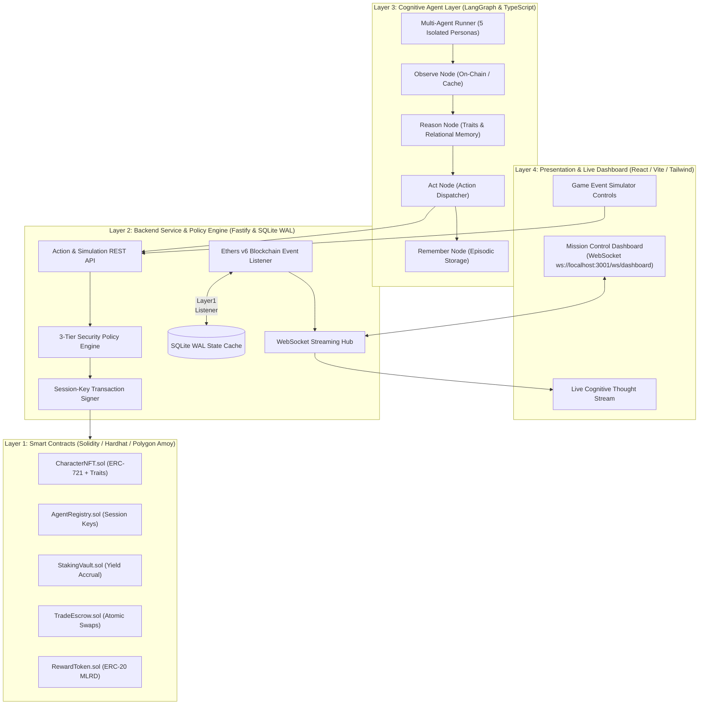

# Autonomous NFT Character Agents

> **Decentralized Multi-Agent Autonomous Gaming System with Scoped Session Keys, On-Chain Personalities, and Real-Time Cognitive Dashboard on Polygon Amoy.**

[](https://github.com/MugheesTayyab/Autonomous-NFT-Character-Agents-for-a-Web3-RPG)
[](https://soliditylang.org/)
[](https://hardhat.org/)
[](https://amoy.polygonscan.com/)
[](https://langchain-ai.github.io/langgraphjs/)
[](https://fastify.dev/)
[](https://react.dev/)
[](https://vitejs.dev/)
[](https://vercel.com/)

---

## 🏛️ System Architecture

The project is structured into four distinct, loosely coupled layers:



---

## 📊 Technology Stack Table

| Layer | Technology | Rationale |
|---|---|---|
| **Smart Contracts** | Solidity 0.8.24, Hardhat, OpenZeppelin v5 | Industry-standard security, gas efficiency, ERC-721/ERC-20 compliance, and reentrancy protection. |
| **Blockchain Network** | Polygon Amoy Testnet | Low gas fees, fast finality (< 2s), and high transaction throughput for autonomous agent operations. |
| **Backend Service** | Fastify, TypeScript, Ethers.js v6 | High-throughput async I/O, low latency, robust WebSocket streaming, and typed smart contract interfaces. |
| **State Cache** | SQLite (WAL Mode enabled) | Single-process ultra-fast local state cache with multi-threaded read concurrency and zero operational overhead. |
| **Cognitive Engine** | LangGraph.js, Zod, Persona Engine | Cyclic state machine for deterministic trait weighting, dynamic memory updates, and structured decision outputs. |
| **Presentation Layer** | React 18, Vite, Tailwind CSS, Lucide | Modern cyber-editorial dashboard with real-time state streaming, localized auto-scroll, and autonomous simulation engine. |

---

## 🛡️ Key Design Decisions

1. **Scoped Session Keys vs. Raw Private Keys**:
   - Master private keys never touch the AI reasoning layer. Character owners delegate ephemeral session keys with strict expiration windows and whitelisted actions (`stake`, `unstake`, `proposeTrade`).
2. **On-Chain Personality Traits as Deterministic Ground Truth**:
   - Character personality attributes (*Risk Tolerance, Aggression, Trust Baseline, Patience*) are stored directly on the blockchain in `CharacterNFT.sol`.
3. **Checks-Effects-Interactions & Policy Bounding**:
   - All state transitions follow Checks-Effects-Interactions. The backend Policy Engine validates all agent actions against session rules before submitting on-chain transactions, guaranteeing zero wasted gas.
4. **Isolated Multi-Agent Cognitive Loops**:
   - Each character operates in its own isolated LangGraph state loop, preserving decentralized autonomy and preventing emergent multi-agent coordination deadlocks.
5. **Standalone Autonomous Simulation Fallback**:
   - The mission control dashboard contains an embedded autonomous simulation state machine that powers client-side interactive gameplay, staking, and simulator triggers when deployed on platforms like Vercel.

---

## ⚡ 5 Character Archetypes

| Token ID | Character Name | Archetype | Risk Tolerance | Aggression | Trust Baseline | Patience | Specialization |
|---|---|---|---|---|---|---|---|
| **#0** | **Kael the Unbroken** | `BERSERKER` | 95 | 90 | 15 | 10 | High-yield staking & aggressive trade proposals |
| **#1** | **Lyra the Tactical** | `STRATEGIST` | 30 | 20 | 80 | 85 | Risk-averse calculations & cooperative trade agreements |
| **#2** | **Rexx the Scavenger** | `SCAVENGER` | 70 | 60 | 25 | 40 | Opportunistic resource capture & yield hunting |
| **#3** | **Voss the Peacemaker**| `DIPLOMAT` | 20 | 5 | 95 | 90 | Maximum bilateral trust & trade facilitation |
| **#4** | **Nyx the Shadow** | `HOARDER` | 10 | 15 | 10 | 95 | Capital preservation & defensive asset holding |

---

## 🚀 Quick Start (Running the Complete System)

### Prerequisites
- Node.js 20+
- npm 10+
- Git

### 1. Clone & Install Dependencies
```bash
# Clone repository
git clone https://github.com/MugheesTayyab/Autonomous-NFT-Character-Agents-for-a-Web3-RPG.git
cd Autonomous-NFT-Character-Agents-for-a-Web3-RPG

# Install smart contracts dependencies
cd contracts && npm install && cd ..

# Install backend dependencies
cd backend && npm install && cd ..

# Install agents dependencies
cd agents && npm install && cd ..

# Install dashboard dependencies
cd dashboard && npm install && cd ..
```

### 2. Run All Test Suites
```bash
# Contracts tests (50 tests)
cd contracts && npm test && cd ..

# Backend service tests (30 tests)
cd backend && npm test && cd ..

# Cognitive agent tests (14 tests)
cd agents && npm test && cd ..

# Dashboard production build verification
cd dashboard && npm run build && cd ..
```

### 3. Launching the Full Stack Locally

**Terminal 1: Local Blockchain Node & Deployment**
```bash
cd contracts
npm run node
# In another tab:
cd contracts
npm run deploy:local
```

**Terminal 2: Backend Service & WebSocket Hub**
```bash
cd backend
npm run operator:setup
npm run dev
```

**Terminal 3: Multi-Agent Cognitive Layer**
```bash
cd agents
npm run dev
```

**Terminal 4: Mission Control Dashboard**
```bash
cd dashboard
npm run dev
```

Open your browser at `http://localhost:5173` to access the Mission Control Dashboard!

---

## 🌐 Vercel Deployment

Deploying the interactive Mission Control dashboard to Vercel:

1. Import this repository in Vercel: [`https://github.com/MugheesTayyab/Autonomous-NFT-Character-Agents-for-a-Web3-RPG`](https://github.com/MugheesTayyab/Autonomous-NFT-Character-Agents-for-a-Web3-RPG)
2. In Vercel Project Settings:
   - **Root Directory**: `dashboard` (or leave default root)
   - **Framework Preset**: `Vite`
   - **Build Command**: `npm run build`
   - **Output Directory**: `dist`
3. Click **Deploy**. The application will compile cleanly and launch with complete autonomous simulated gameplay!

---

## 📜 Deployed Smart Contracts (Polygon Amoy Testnet)

| Contract | Description | Standard |
|---|---|---|
| `CharacterNFT.sol` | Character NFT with on-chain traits & metadata | ERC-721 |
| `AgentRegistry.sol` | Time-bounded scoped session key delegation & Kill Switch | Custom Registry |
| `StakingVault.sol` | Continuous autonomous reward yield staking | Custom Staking |
| `TradeEscrow.sol` | Bilateral escrow & atomic two-way NFT swaps | Custom Escrow |
| `RewardToken.sol` | Staking reward emissions token ($REWA) | ERC-20 |

---

## 📄 License

This project is open-source and licensed under the **MIT License**.
