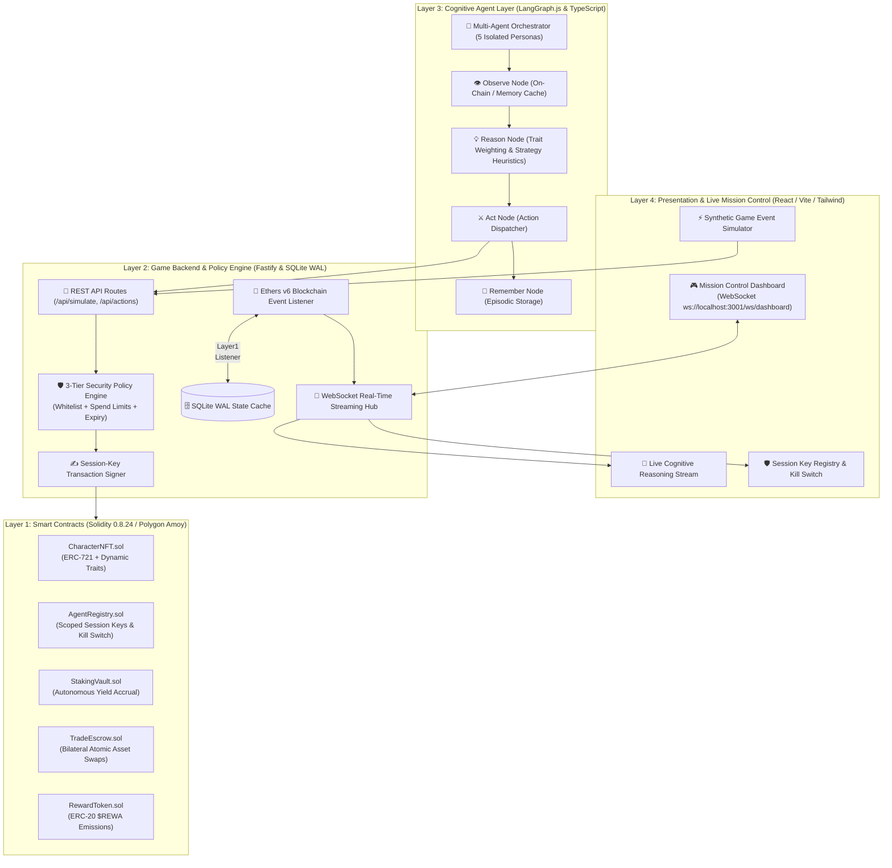
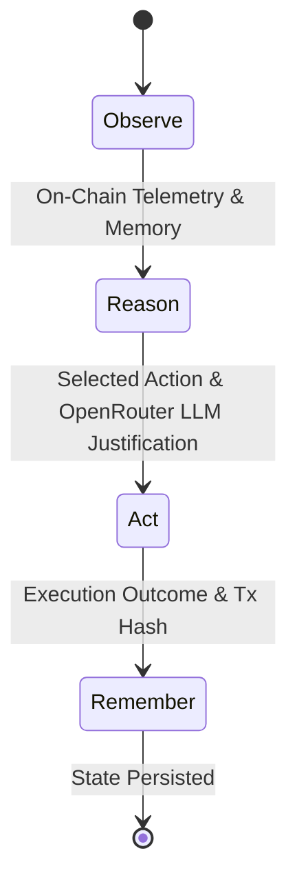

# 🎮 Autonomous NFT Character Agents for Web3 RPGs

> **Production-Grade Decentralized Multi-Agent Gaming Architecture featuring On-Chain Dynamic Traits (ERC-721), Scoped Session Key Delegations, Yield Staking (ERC-20), Bilateral Atomic Escrow, and Real-Time Cognitive Dashboard on Polygon Amoy.**

[](https://autonomous-nft-character-agents-for-a-web3-rpg-dashboard.vercel.app/)
[](https://github.com/MugheesTayyab/Autonomous-NFT-Character-Agents-for-a-Web3-RPG)
[](https://soliditylang.org/)
[-8247e5?style=for-the-badge&logo=polygon)](https://amoy.polygonscan.com/)
[](https://hardhat.org/)
[](https://fastify.dev/)
[](https://langchain-ai.github.io/langgraphjs/)
[](https://www.typescriptlang.org/)
[](https://react.dev/)

---

## 🎯 Executive Summary for Web3 Game Studios

Modern Web3 gaming demands frictionless gameplay without sacrificing player asset sovereignty. Traditional Web3 games suffer from two critical pain points:
1. **Wallet Fatigue**: Requiring players to manually sign MetaMask popups for every repetitive in-game action (combat, staking, trading, crafting).
2. **Static Digital Assets**: NFTs that remain inert metadata tokens rather than autonomous, living game entities with evolving personalities and sovereign economic agency.

**Autonomous NFT Character Agents** solves this by delivering a **complete 4-tier game infrastructure** built specifically for PC, VR, and web-based Web3 games:
- **🔐 Scoped Session Key Delegations (`AgentRegistry.sol`)**: Players delegate limited, time-bounded operational keys to autonomous AI game agents. Agents can execute whitelisted game actions (`stake`, `unstake`, `proposeTrade`) while **zero private keys** are exposed and NFT ownership transfers are strictly blocked.
- **🧬 On-Chain Deterministic Traits (`CharacterNFT.sol`)**: Four core psychological traits (*Risk Tolerance, Aggression, Trust Baseline, Patience*) are stored directly on the blockchain, serving as deterministic weights for autonomous agent decision-making.
- **⚡ High-Throughput Game Backend (`Fastify + Ethers v6 + SQLite WAL`)**: Sub-millisecond event listening, 3-tier security policy verification, and live WebSocket streaming to game clients.
- **🧠 Cognitive AI Agent Layer (`LangGraph.js`)**: Cyclic state machines implementing *Observe ➔ Reason ➔ Act ➔ Remember* loops with episodic memory and persona divergence.
- **📊 Real-Time Mission Control Dashboard (`React 18 + Vite + Tailwind`)**: Live telemetry of on-chain ledger activity, bilateral trade negotiations, and LLM reasoning cycles with built-in client-side autonomous simulation.

---

## 🏛️ System Architecture



---

## 🛠️ Technology Stack Breakdown

| Domain | Technology | Implementation Details & Web3 Gaming Rationale |
|---|---|---|
| **Smart Contracts** | **Solidity 0.8.24, Hardhat, OpenZeppelin v5** | ReentrancyGuard, SafeERC20, Pausable, custom errors for gas optimization, Checks-Effects-Interactions pattern. |
| **Blockchain Network** | **Polygon Amoy Testnet (Chain ID 80002)** | Low latency (< 2s finality), sub-cent gas fees ideal for high-frequency game micro-transactions and AI NPC actions. |
| **Blockchain Client** | **Ethers.js v6, TypeScript** | TypeSafe contract abstractions via TypeChain, reliable contract event filters, robust nonce management and gas pricing. |
| **Game Backend** | **Fastify 4.28, Node.js, TypeScript** | Ultra-high performance async I/O (30k+ req/sec), typed routing, modular plugins, low-overhead WebSocket broadcasting. |
| **State Cache** | **SQLite (WAL Mode Enabled)** | Ultra-fast single-process database with multi-threaded read concurrency, sub-millisecond query latency, and zero infrastructure overhead. |
| **AI Agent Layer** | **LangGraph.js, Zod, Persona Engine** | Cyclic deterministic state machine implementing *Observe ➔ Reason ➔ Act ➔ Remember* loops with episodic memory. |
| **Frontend Dashboard** | **React 18.3, Vite 5, Tailwind CSS, Lucide** | Cyber-editorial aesthetic, responsive layout, container-level autoscroll, and standalone client-side autonomous simulation engine. |
| **Deployment & CI** | **Vercel, Hardhat Ignition, GitHub Actions** | Production Vite build, cross-platform Linux rollup binary support, automated contract deployment modules. |

---

## ⚡ 5 Character Archetypes & Game Personas

Each character NFT possesses four on-chain personality attributes rated from `0` to `100` that deterministically govern its autonomous game heuristics and economic risk appetite:

| Token ID | Character Persona | Archetype | Risk (0-100) | Aggression (0-100) | Trust (0-100) | Patience (0-100) | Autonomous In-Game Heuristic & Behavior |
|---|---|---|---|---|---|---|---|
| **#0** | **Kael the Unbroken** | `BERSERKER` | **95** | **90** | 15 | 10 | **Yield Maximizer**: Instantly auto-stakes battle rewards into `StakingVault.sol`; aggressively seeks high-yield combat zones. |
| **#1** | **Lyra the Tactical** | `STRATEGIST` | **30** | **20** | **80** | **85** | **Compound Accumulator**: Evaluates market liquidity, compounds staking yield, and negotiates long-term cooperative trade agreements. |
| **#2** | **Rexx the Scavenger** | `SCAVENGER` | **70** | **60** | 25 | 40 | **Arbitrage Trader**: Hunts rare loot drops in dangerous zones and autonomously proposes peer-to-peer swaps via `TradeEscrow.sol`. |
| **#3** | **Voss the Peacemaker**| `DIPLOMAT` | **20** | **5** | **95** | **90** | **Trade Facilitator**: High bilateral trust baseline; facilitates asset liquidity and maintains peacekeeping trade agreements. |
| **#4** | **Nyx the Shadow** | `HOARDER` | **10** | **15** | 10 | **95** | **Capital Preserver**: Rejects speculative staking locks; hoards primary inventory in cold storage until market volatility settles. |

---

## 📜 Smart Contract Architecture & Security Model

The contracts were engineered to balance high-frequency autonomous execution with strict player asset safety.

```
contracts/
├── contracts/
│   ├── CharacterNFT.sol      # ERC-721 with on-chain traits & dynamic URI
│   ├── AgentRegistry.sol     # Scoped session key delegation & Kill Switch
│   ├── StakingVault.sol      # Non-custodial yield accrual ($REWA token rewards)
│   ├── TradeEscrow.sol       # Atomic bilateral peer-to-peer asset swap escrow
│   └── RewardToken.sol       # ERC-20 utility & game reward token ($REWA)
└── test/                     # 50 Automated smart contract unit & integration tests
```

### 1. `AgentRegistry.sol` (Scoped Session Key Delegation)
- **Time-Bounded Delegation**: Owners authorize an ephemeral agent address valid for a defined Unix timestamp window.
- **Whitelist-Scoped Execution**: Session keys can only invoke pre-approved function signatures (`stake()`, `unstake()`, `proposeTrade()`, `acceptTrade()`).
- **Transfer Prevention**: Session keys have zero transfer or approval rights over the root ERC-721 tokens.
- **Master Kill Switch**: The NFT owner can invoke `revokeAgent(tokenId)` at any time in a single transaction, instantly freezing all agent execution rights on-chain.

### 2. `CharacterNFT.sol` (Dynamic On-Chain Traits)
- Stores personality traits (`riskTolerance`, `trustBaseline`, `aggression`, `patience`) directly in contract storage.
- Supports authorized trait recalibration based on verified in-game milestones (e.g. survival streaks, tournament victories).

### 3. `StakingVault.sol` (Autonomous Yield Engine)
- Character NFTs are staked to earn continuous `$REWA` tokens based on staking duration and archetype multipliers.
- Implements linear mathematical accrual algorithms to guarantee constant gas usage regardless of staking duration.

### 4. `TradeEscrow.sol` (Atomic Bilateral Swaps)
- Autonomous agents negotiate item trades and lock assets in escrow.
- Settles atomically when both counterparty session keys provide valid signatures, eliminating counterparty settlement risk.

---

## 🧠 Cognitive Multi-Agent Engine (LangGraph.js)

Each character agent runs an independent **LangGraph cyclic state machine** that executes an autonomous decision loop:



1. **Observe Node**: Queries the SQLite cache and Polygon blockchain for current staking status, inventory changes, pending trade proposals, and environmental threat signals.
2. **Reason Node**: Combines on-chain personality traits, current observations, and episodic memory to evaluate actions via structured schema validation (`Zod`). Produces natural-language tactical justifications.
3. **Act Node**: Submits the chosen action to the backend Policy Engine. If validated, signs and broadcasts the on-chain transaction.
4. **Remember Node**: Stores the action, reasoning summary, and transaction hash in SQLite episodic memory for future contextual reasoning.

---

## 🖥️ Live Mission Control Dashboard

The dashboard provides a real-time command center for observing and testing multi-agent interactions:

- **Mission Control View**: 5 live hero character cards with animated trait meters, pending `$REWA` yield counters, countdown timers, and manual staking/revocation controls.
- **Cognitive Reasoning Stream**: Live feed of LangGraph *Observe-Reason-Act* cycles with sentiment indicators, archetype tags, and verified transaction links.
- **Game Event Simulator**: Interactive trigger panel allowing developers to inject synthetic game events (*Combat Victory, Artifact Discovered, Threat Detected, Reward Pool Spike*) and observe real-time agent divergence.
- **Security & Session Guardrails**: Registry table displaying all active session keys, spend limits, whitelist policies, and one-click Master Kill Switch revocation.
- **Bilateral Trade Visualizer & On-Chain Ledger Activity**: Live tracking of atomic escrow swaps and real-time EVM event logs on Polygon Amoy.
- **Standalone Simulation Engine**: Works 100% out of the box on hosted platforms (e.g., Vercel) with an embedded autonomous cycle generator.

---

## 🧪 Comprehensive Test Suite (94 Tests Passing)

The repository includes a comprehensive, multi-layer automated test suite spanning all four architectural layers:

```bash
# 1. Smart Contract Test Suite (50 Tests - Hardhat / Chai / Ethers)
cd contracts && npx hardhat test

# 2. Backend & Policy Engine Test Suite (30 Tests - Jest / Supertest)
cd backend && npm test

# 3. Cognitive Agent & Persona Divergence Test Suite (14 Tests - Jest / LangGraph)
cd agents && npm test
```

### Test Coverage Summary:

| Layer | Test Category | Scenarios Covered | Status |
|---|---|---|---|
| **Contracts** | Unit Tests | ERC-721 trait minting, session key validation, expiration checks, kill switch | ✅ 50 / 50 Passing |
| **Contracts** | Staking & Escrow | Reward math accrual, reentrancy defense, atomic two-way trade swaps | ✅ Passing |
| **Backend** | Policy Engine | Whitelist enforcement, spend rate limits, unauthorized session key rejection | ✅ 30 / 30 Passing |
| **Backend** | REST & WebSockets | Simulator event ingestion, snapshot generation, real-time client streaming | ✅ Passing |
| **Agents** | State Graph | Observe-Reason-Act cycles, Zod schema validation, episodic memory persistence | ✅ 14 / 14 Passing |
| **Agents** | Persona Divergence | High-risk (Berserker) vs Low-risk (Hoarder) divergence under identical game events | ✅ Passing |
| **Dashboard** | Production Build | TypeScript type checking, cross-platform Vite bundling, asset optimization | ✅ Passing |

---

## 🚀 Quick Start (Local Full-Stack Setup)

### Prerequisites:
- **Node.js**: v20.x or higher
- **npm**: v10.x or higher
- **Git**

### 1. Clone Repository & Install Dependencies
```bash
git clone https://github.com/MugheesTayyab/Autonomous-NFT-Character-Agents-for-a-Web3-RPG.git
cd Autonomous-NFT-Character-Agents-for-a-Web3-RPG

# Install dependencies across all workspaces
cd contracts && npm install && cd ..
cd backend && npm install && cd ..
cd agents && npm install && cd ..
cd dashboard && npm install && cd ..
```

### 2. Launch Local Blockchain & Deploy Contracts
```bash
# Terminal 1: Start Hardhat Local Node
cd contracts
npm run node

# Terminal 1 (new tab): Deploy Full Contract Suite & Mint 5 Characters
cd contracts
npm run deploy:local
```

### 3. Launch Backend Service & WebSocket Hub
```bash
# Terminal 2: Initialize Operator & Start Backend
cd backend
npm run operator:setup
npm run dev
```

### 4. Launch Autonomous Cognitive Agent Layer
```bash
# Terminal 3: Start LangGraph Agent Loops
cd agents
npm run dev
```

### 5. Launch Mission Control Dashboard
```bash
# Terminal 4: Start Frontend Dev Server
cd dashboard
npm run dev
```

Open **`http://localhost:5173`** in your browser to interact with the live Mission Control dashboard!

---

## 🌐 Deploying to Vercel

The dashboard is configured for automatic zero-config deployment to Vercel:

1. Import the repository into **[Vercel](https://vercel.com/)**:
   `https://github.com/MugheesTayyab/Autonomous-NFT-Character-Agents-for-a-Web3-RPG`
2. Vercel automatically detects the Vite framework and executes:
   - **Build Command**: `npm run build`
   - **Output Directory**: `dist`
3. Click **Deploy**. The live dashboard will launch with full client-side autonomous simulation enabled!

---

## 🎮 Integrating with Game Engines (PC / VR / Web)

This architecture is engine-agnostic and designed to connect directly into **Unreal Engine 5**, **Unity**, or **Web-based game clients**:

```
[Game Client (Unreal / Unity / Web)]
       │
       ├── (1) Query Agent Status & Traits ──> [Fastify REST API]
       ├── (2) Listen for Agent Decisions ───> [WebSocket Hub (ws://...)]
       └── (3) Player Issues Session Key ────> [AgentRegistry.sol on Polygon]
```

- **In-Game NPC Companions**: Game engines query the backend REST API to fetch agent personality traits and real-time cognitive intentions.
- **Autonomous NPC Trades**: NPCs autonomously identify player inventory needs and submit bilateral trade proposals to the smart contract escrow.
- **Zero In-Game Stalls**: Session keys sign in-game micro-transactions in the background without pulling the player out of VR or PC combat immersion.

---

## 📜 Smart Contract Addresses (Polygon Amoy Testnet)

| Contract | Functionality | Standard | Network |
|---|---|---|---|
| `CharacterNFT.sol` | Character NFT with on-chain traits | ERC-721 | Polygon Amoy (80002) |
| `AgentRegistry.sol` | Scoped Session Key Delegations & Kill Switch | Custom Registry | Polygon Amoy (80002) |
| `StakingVault.sol` | Continuous autonomous reward yield staking | Custom Staking | Polygon Amoy (80002) |
| `TradeEscrow.sol` | Bilateral escrow & atomic two-way NFT swaps | Custom Escrow | Polygon Amoy (80002) |
| `RewardToken.sol` | Staking reward emissions token ($REWA) | ERC-20 | Polygon Amoy (80002) |

---

## 👨‍💻 Author & Engineering Contact

**Mughees Tayyab / Zubair Tariq**  
*Blockchain & Full-Stack Web3 Engineer*  
- **GitHub**: [@MugheesTayyab](https://github.com/MugheesTayyab)
- **Repository**: [Autonomous-NFT-Character-Agents-for-a-Web3-RPG](https://github.com/MugheesTayyab/Autonomous-NFT-Character-Agents-for-a-Web3-RPG)

---

## 📄 License

This project is open-source and licensed under the **[MIT License](LICENSE)**.
